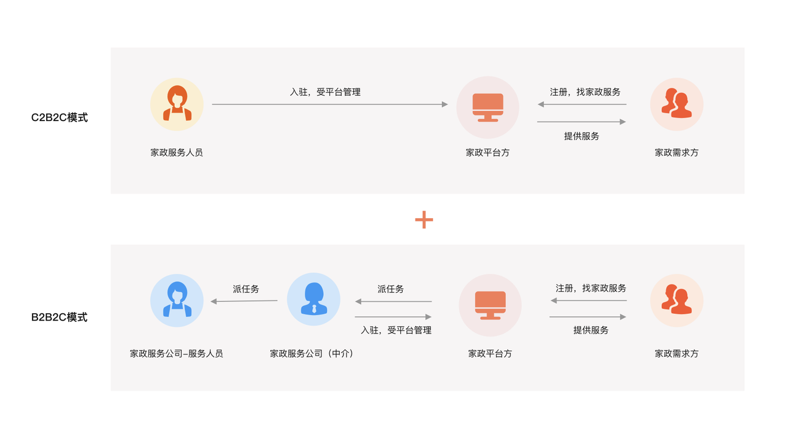

后台管理：https://jzo2o-operation.itheima.net/#/dashboard/base

机构端：https://jzo2o-institution.itheima.net/#/dashboard/base

前端工程代码：https://gitee.com/itxinfei/jzo2o-web

### 一、项目介绍

#### 1、项目背景

2015年国家就提出了"互联网+"的行动计划，什么是"互联网+"?

​		“互联网+”简单的说就是“互联网+传统行业”，互联网为传统行业赋能,利用互联网具备的优势特点对传统行业进行优化升级转型，最终推动社会不断地向前发展。互联网+的成功案例有很多，像滴滴出行、美团外卖和共享单车等平台将传统出行、餐饮和交通等行业与互联网连接，提供更便捷、经济高效的服务。
​		云岚到家项目是一个家政服务o2o平台，互联网+家政是继打车、外卖后的又一个风口，创业者众多，比如：58到家，天鹅到家等，o2o（Online To Offline）是将线下商务的机会与互联网的技术结合在一起，让互联网成为线下交易的前台，同时起到推广和成交的作用。
​		家政服务o2o市场前景非常好，中国社会的家庭小型化、人口老龄化进程加快，加之二胎政策、三孩政策的推行，创造了大量对于家政服务的潜在需求。艾媒咨询发布《2022-2023年中国家政服务行业发展剖析及行业投资机遇分析报告》显示，从2015年的2776亿元已提升至2021年的10149亿元，进入万亿级市场行列。

中国家政服务业从业人员数量规模逐年稳步增长

#### 2、运营模式

我们调研了家政服务O2O平台的运营模式，如下：

**C2B2C:**
在家政 O2O（Online to Offline，线上到线下）领域中，"Consumer to Business to Consumer"（C2B2C）描述了一个商业模式，消费者不仅可以通过平台获取家政服务，还有机会成为服务提供者。在这个背景下，C2B2C 模式通常指的是：

1. 消费者（Consumer）：
- 最终的家庭用户，他们需要家政服务，例如清洁、保姆、维修等。
2. 企业（Business）：
- 在家政 O2O 中，企业通常是在线平台，提供家政服务的中介。这些平台通过在线渠道为消费者提供了查找、预订、支付等服务，同时也可能为家政服务提供者提供了工作机会。
3. 消费者（家政服务提供者）：
- 在 C2B2C 模式中，一些消费者也可以成为服务的提供者。这些个体可能是独立的家政服务专业人员，他们可以在家政 O2O 平台上注册，提供自己的服务，并被其他需要服务的消费者雇佣。

**B2B2C:**
代表着"Business to Business to Consumer"，即企业到企业到消费者的模式。家政服务平台作为中间商，通过与各种家政服务提供商（家政服务公司）合作，为消费者提供多样化的家政服务选择。
B2B2C与C2B2C的区别是：B2B2C中服务提供者是家政服务中介公司，在C2B2C中是服务提供者是拥有服务技能的服务人员（散户）。
本项目结合了C2B2C和B2B2C模式，个人和家政服务中介都可以通过平台提供家政服务，如下图：
项目包括四个端：用户端(小程序)、服务端（app）、机构端(PC)、运营管理端(PC)，四个端对应四类用户角色：
家政需求方：通过用户端小程序完成在线预约下单、支付、评价、投诉、退款等操作。
家政服务人员：通过服务端APP完成在线接单、结算等操作。
家政服务公司：通过机构端完成在线接单、派单、投诉处理、结算等操作。
平台方：通过管理端完成服务人员管理、机构管理、订单管理、财务管理等操作，一笔完成的订单，结算时按照分成比例平台进行抽成。

#### 3、项目业务流程

   项目核心业务流程如下：

​     核心流程：

1. 运营端在运营区域上架家政服务
   比如：在北京上架 日常保洁、空调维修。
2. 用户端通过定位区域获取当前区域的服务项目，选择家政服务，下单、支付
3. 家政服务人员及家政服务公司（机构）通过平台抢单
4. 家政服务人员现场服务，平台跟踪管理整个服务过程。
5. 服务完成，用户评价、售后服务等。

#### 4、项目演示

演示环境准备：

1. 启动jzo2o-gateway
2. 启动jzo2o-customer
3. 启动jzo2o-publics
4. 启动jzo2o-foundations
5. 启动jzo2o-orders-manager
6. 启动jzo2o-orders-seize
7. 启动管理端（前端）
8. 启动服务端（前端）
9. 启动用户端（前端）
10. 启动canal前需要reset master，删除canal的meta.dat。

演示核心业务流程。
1. 服务管理，服务上架
2. 用户下单、支付（支付可以略过）
3. 服务人员抢单
4. 现场服务，开始服务、完成服务

### 二、项目架构

#### 1、项目业务模块

项目业务模块图

我们根据业务流程去分析各个模块的功能：

1. 服务管理：对家政服务项目进行管理，最后在指定区域上架服务后用户可在当前区域购买。
2. 下单支付：用户通过小程序完成下单支付，进入小程序首页查询服务，用户选择服务，下单并支付
3. 抢单：服务人员和机构进行抢单。首先服务人员和机构设置接单范围、服务技能、开启抢单开关，然后进入抢单界面进行抢单。
4. 派单调度：平台根据撮合匹配算法通过任务调度将订单和服务人员进行撮合匹配，促进成交。
5. 订单管理：对订单的生命周期进行管理，包括创建订单、取消订单、删除订单、历史订单等。
6. 服务人员管理：对服务人员的信息、认证等进行管理。
7. 企业管理：对机构的信息、认证进行管理。
8. 客户管理：对c端用户的信息、用户的状态等信息进行管理。
9. 营销管理：对优惠券活动进行管理。

#### 2、项目架构

项目是基于Spring Cloud Alibaba框架构建的微服务项目，采用前后端分离模式进行开发，系统架构图如下：

用户层：

1. 包括四个端：运营端(PC)、服务端（APP）、机构端（PC）、用户端（小程序）
2. 负载层：反向代理、负载均衡。
3. 服务层：包括网关、业务微服务、基础服务。
4. 业务微服务：包括运营基础服务、客户管理服务、订单管理服务、抢单服务、派单服务、支付服务等。
5. 基础服务：Nacos（服务注册、配置中心）、XXL-JOB（任务调度）、RabbitMQ（消息队列）、Elasticsearch（全文检索）、Canal（数据同步）、Sentinel（熔断降级、限流）等。
6. 数据层：MySQL数据库存储：服务信息、区域信息、客户信息、订单信息、支付信息、抢单池、派单池、结算信息等。
7. 分库分表：使用ShardingShphere进行分库分表。
8. TiDB分布式数据库存储：历史订单信息。
9. 消息队列：存储数据同步消息、各类异步消息等。
10. 索引：服务信息、服务提供者信息、订单信息等。
11. 缓存：服务信息、订单信息、服务单信息等。

项目核心交互流程如下图：

#### 3、学习收获

1. 前边大概了解了项目情况，学完项目我们可以收获哪些呢？
2. 掌握项目需求分析能力
3. 掌握系统分析与设计的能力
4. 掌握Spring Cloud 在项目中的开发与调优能力
5. 掌握Redis在项目中的应用能力
6. 掌握缓存技术方案的分析与设计能力
7. 掌握Canal+MQ异构数据同步的开发调试能力
8. 掌握Elasticsearch全文检索与地理搜索的开发能力
9. 掌握ShardingSphere分库分表的方案设计与开发能力
10. 掌握Seata分布式事务控制的开发能力
11. 掌握数据冷热分离技术方案的设计与开发能力
12. 掌握XXL-JOB+线程池任务调度方案的设计与开发能力
13. 掌握系统调优与线上故障处理的能力
14. 掌握状态机组件的设计与开发能力
15. 掌握门户业务的设计与开发能力
16. 掌握订单支付业务的系统设计与开发能力
17. 掌握优惠券&活动管理业务的系统设计与开发能力
18. 掌握秒杀抢购业务的常见设计方案与开发能力
19. 掌握派单调度类业务的系统设计与开发能力
20. 掌握客户管理业务的系统设计与开发能力
21. 掌握活动管理业务的系统设计与开发能力
22. 掌握搜索附近业务的系统设计与开发能力
23. 掌握服务管理&商品管理业务的系统计与开发能力
24. 掌握统计分析与看板业务的系统设计与开发能力